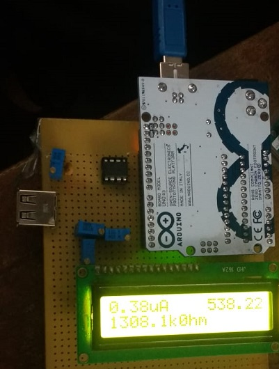
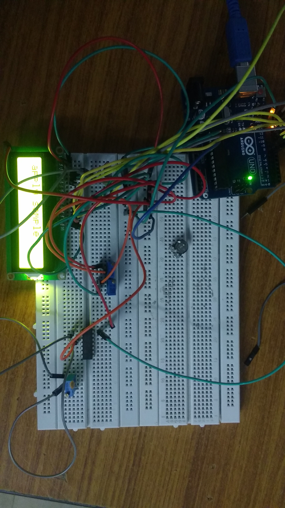
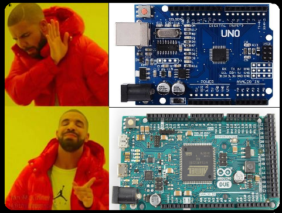
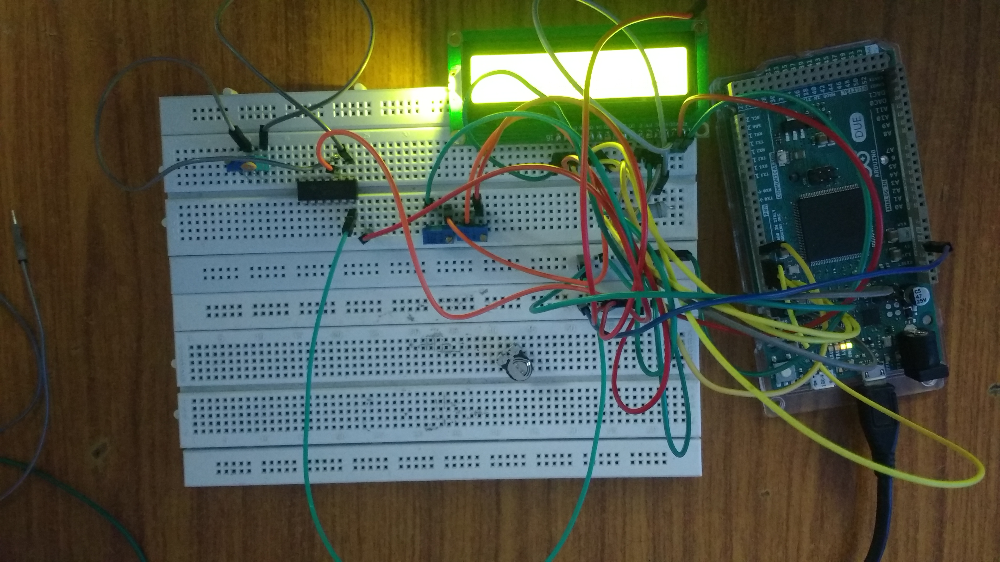
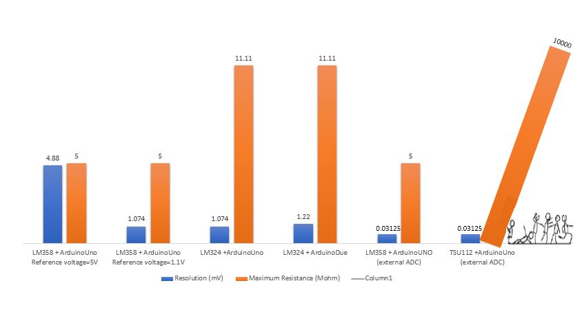

# Read-Out-Circuit-for-Biosensors
The readout circuit is designed to read the value of the sample electrode, and display its value on LCD.
The read out circuit that has been used in our project is based on a CTNI test. The readout circuit has been designed to accurately predict the amount of troponin in the blood, by the means of conductivity of analyte.

## So That's how it all started!!!
 <ul>
  <li>CTNI TEST</li>
  <li>HOW IS IT CONDUCTED?</li>
  <li>HOW WE DESIGNED A CIRCUIT FOR THE SAME PURPOSE.</li>
  <li>Basically, It’s called – THE READOUT MACHINE……OR whatever fancy name you like!</li>
</ul> 

## Different Sections of the Project
 <ul>
  <li>THE SOFTWARE SECTION: Carrying out simulations on the circuit</li>
  <li>THE HARDWARE SECTION: Designing and working on the hardware section, taking readings, improving resolution</li>
  <li>THE DISPLAY SECTION: Development of an app which was bluetooth controlled</li>
</ul> 

## The HARDWARE SECTION
Here’s what the circuit looks like:

Well….In reality it looks like this……

## Hardware components: (the stuff we used in our circuit)
 <ul>
  <li>ATMEGA 328</li>
  <li>Operational amplifiers: LM358/LM324/TSU112/TSU111</li>
  <li>ADC: initially Arduino Uno, due then ADS1115</li>
  <li>Resistors</li>
  <li>Capacitors</li>
  <li>LCD display</li>
</ul> 

## USING LM358 and Arduino UNO

Lm358 is an operational amplifier (op-amp) and in this circuit we are using it as a current amplifier. Lm358
has two independent comparators inside it, but here we are using comparator with inputs at PIN 2(Inverting)
and PIN3 (non inverting). Here we have a voltage divider circuit that gives 500mv supply to the non inverting
input of the op-amp. The 100k resistor provides a feedback path and determines the gain. Also the output
(w.r.t. ground) is taken through the PIN1.
For an ideal op-amp there is a rule that the potential at both the inputs will be the same which is done through
the feedback (the concept of virtual ground). If at non inverting input there is some potential of 500mV then
the same will appear at the inverting input and the current through the feedback resistor will accordingly
increase and decrease and that will decide the potential at an output.

  <table>
  <tr>
    <th>Bias Current of Op-amp: 100nA</th>
    <th colspan="2">Resolution of ADC: 10 bits   </th>
  </tr>
  <tr>
    <td>Maximum resistance = 5M&ohm; </td>
    <td>Vref = 5V </td>
    <td>Vref = 1.1V </td>
  </tr>
  <tr>
    <td> </td>
    <td>Vchange = 4.88mV </td>
    <td>Vchange = 1.074mV </td>
  </tr>
</table>

## MOVING TOWARDS BETTER RESOLUTION: USING LM324 and ArduinoUNO!

In order to increase the accuracy of the instrument we use LM324, which is a better amplifier in terms of
biasing current. Lm324 has biasing current of 45nA, which is much less than that of 100nA of LM358. In
order to understand the relevance of using different IC, we first need to understand the importance of Biasing
Current in an op-amp.
Importance of Biasing Current:
One of the golden rules of op amp analysis says this: no current flows into either input terminal. This concept
is key for analyzing an amplifier's signal gain. However, in reality, a small current flows into both inputs to
bias the input transistors. Unfortunately, this bias current gets converted into a voltage by the circuit's local
resistors and amplified right along with the signal. The result is an output error in your circuit. What can we
do about it? A clever choice of resistor values can help us cancel most of the output error. The remaining
error can be adjusted to zero if necessary. Hence less is the biasing current, less is the error in readout circuit,
and more accurate the instrument is.

<ul>
  <li>WHY LM324 is better than LM358? 
  Lm324 has the biasing current of 45nA whereas the LM358 has the biasing current of 100nA.</li>
  <li>WHAT is up with THE BIASING CURENTS ?? 
One of the golden rules of op amp analysis says this: no current flows into either input terminal. This concept is key for analyzing an amplifier's signal gain. However, in reality, a small current flows into both inputs to bias the input transistors. Unfortunately, this bias current gets converted into a voltage by the circuit's local resistors and amplified right along with the signal. The result is an output error in your circuit. What can you do about it? A clever choice of resistor values can help you cancel most of the output error. The remaining error can be adjusted to zero if necessary.</li>
 </ul>
 
 ## RESOLUTION : WHY DO WE EVEN CARE??
 <ul>
 <li>Embedded into the Arduino microprocessor is an Analog to Digital Converter (ADC).   This ADC takes an analog signal, measures it, and converts it to digital (or binary).  The number of bits used to the digitally communicate the binary value represents the resolution.</li>
 <li>In fact,  ADCs are often described by their resolution.   When we hear that a device has a 10 bit Analog to Digital Converter,  we know that it uses ten digital bits to describe an analog value.  Similarly, a 24 bit Analog to Digital converter will use 24 pieces of information to tell us what the analog value is.</li>
 <li>Generally speaking, when a device has higher resolution, it provides more detail, information, or definition than the device that has lower resolution.</li>
 </ul>
 
  <table>
  <tr>
    <th>Bias Current of Op-amp: 45nA</th>
    <th colspan="2">Resolution of ADC: 10 bits   </th>
  </tr>
  <tr>
    <td>Maximum resistance = 11.11M&ohm; </td>
    <td>Vref = 5V </td>
    <td>Vref = 1.1V </td>
  </tr>
  <tr>
    <td> </td>
    <td>Vchange = 4.88mV </td>
    <td>Vchange = 1.074mV </td>
  </tr>
</table>

  

## USING LM324 and ArduinoDUE!

Here we use LM324 with the combination of Arduino Due, as the module offers 12 bit
ADC. Lm324 as we know offers 100nA of Biasing current. In order to Calibrate our device,
we need higher resolution so as to display more number of resistance and voltage values. 
Even though the Arduino Due with higher bit ADC was used, we were unable to achieve
better accurate results as compared to the LM358, this was partially due to the heating losses in the Arduino’s microcontroller itself. The results thus obtained deviated slightly more than the actual values of voltage and electrode resistance.
Hence, in order to achieve greater amount of accuracy and resolution in the read out circuit we
opted for external Analog to digital converter.

  <table>
  <tr>
    <th>Bias Current of Op-amp: 45nA</th>
    <th colspan="2">Resolution of ADC: 12 bits   </th>
  </tr>
  <tr>
    <td>Maximum resistance = 11.11M&ohm; </td>
    <td>Vref = 5V </td>
    <td>Vref = 1.1V </td>
  </tr>
  <tr>
    <td> </td>
    <td>Vchange = 1.22mV </td>
    <td>Vchange = 0.268mV </td>
  </tr>
</table>

## STRECHING OUR BOUNDARIES: USING LM358 AND ADS1115

Why ADS1115? ADS1115 is a 16 bit analog to digital convertor. Earlier we were using 10 bit ADC in Arduino Uno or 12 bit ADC in Arduino Due. In order to display the exact same value of the voltage and resistances, we need to increase the resolution of our ADC’s. Due to unavailability of higher bit ADC’s in Arduino modules, we went for an external ADC which could further be interfaced with Arduino. 
The ADS1115 is an external digital analog converter (ADC) that we can connect to a processor like Arduino to measure analog signals. Arduino has internal ADCs that we use when we use the Arduino analog inputs. On the Arduino Uno, Mini and Nano models, we have 6 ADC of 10 bits. The ADS1115 provides 4 16-bit ADCs, 15 for the measurement and one last for the sign. The ADS1115 is connected by I2C, so it is easy to read. It has 4 addresses, which is chosen by connecting the ADDRESS pin. The interest of using an ADC such as the ADS1115 is to obtain greater precision, in addition to freeing the processor from this burden. In addition, in certain configurations, it is possible to measure negative voltage. Using ADS1115 we were able to get a resolution of 0.1875 mV.

## LETS GO ONE STEP FURTHER: USING TSU112 AND ADS1115

Why TSU112? 
TSU111, TSU112 and the TSU114 are operational amplifiers (op-amp) which offer an ultra low-power consumption per channel of 900 nA typical and 1.2 μA maximum when supplied by 3.3 V. Combined with a supply voltage range of 1.5 V to 5.5 V. these features allow the TSU11x to be efficiently supplied by a coin type Lithium battery or a regulated voltage in low-power applications. 

Since we required a higher bit ADC for more resolution and an op-amp having lower
biasing current to improve the accuracy of the read out circuit, we moved towards an
external ADC and TSU112 having biasing current of about 10pA. Using the above
combination we could achieve the resistance values of upto 10GΩ and the change in
voltage that the machine could record would be upto 0.03125. ADS1115 being 16 bit ADC
uses the reference voltage 1.025 volts and out of 16 bits, one bit is a signed bit, whereas
the remaining 15 bits are for resolution purpose.

## Results...

 

  

 

